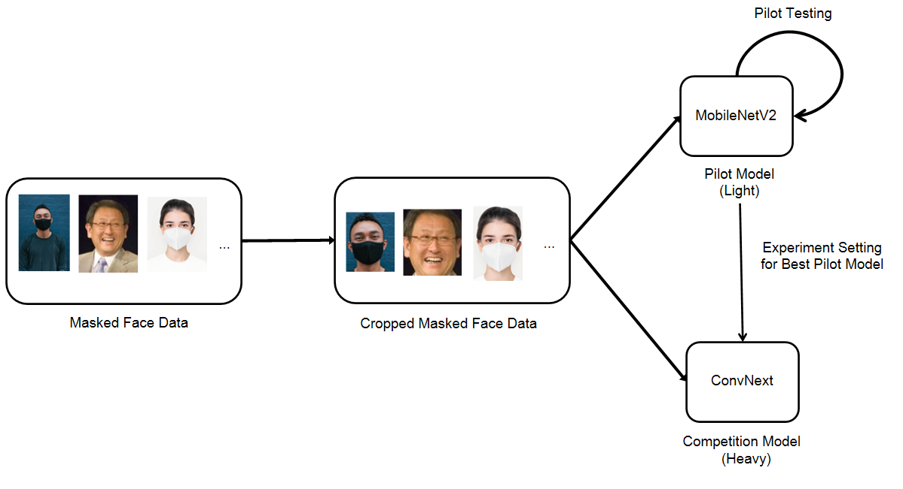

# Boostcamp-AI-Tech-Level1-BE1
<!-- ALL-CONTRIBUTORS-BADGE:START - Do not remove or modify this section -->
[](#contributors-)
<!-- ALL-CONTRIBUTORS-BADGE:END -->

- [부스트캠프 AI Tech](https://boostcamp.connect.or.kr/program_ai.html) - Level1. Mask Classification Competition  

# Introduction
본 프로젝트는 카메라로 비친 사람의 얼굴 이미지만으로 이 사람의 마스크 착용 여부(마스크를 썼는지 쓰지 않았는지, 썼다면 올바르게 착용했는지), 성별(남성, 여성), 나이(30대 미만, 30대 이상 60대 미만, 60대 이상)를 자동으로 가려낼 수 있는 모델의 구축을 목표로 하였다. 

대회 형식으로 총 20팀이 참여하여 프로젝트가 진행이 되었고, f1 score를 기준으로 총 18개의 label로 잘 분류했는지를 측정하여 각 팀이 제작한 모델의 성능을 판단하였다. 

이런 모델을 탑재한 시스템이 마스크 착용 여부를 판단해야 하는 장소에 갖춰져 있다면 적은 인적자원으로도 효율적으로 검사를 할 수 있어 활용 가치가 높다고 볼 수 있다.



<br />

----
## Changes

**`2023-04-20`**: 
- Add Weighted Random Sampler

**`2023-04-19`**: 
- code refactoring

**`2023-04-19`**: 
- change age label threshold (60 -> 59)

**`2023-04-18` -  loss, optimizer Test**: 
- loss
  - before : f1 loss
  - ater : f1 loss * 1.5 + label smoothing loss * 1.0
- task change
  - before : 18 single labels
  - after : 3, 2, 3 multi labels
- optimizer : AdamW

**`2023-04-17` -  Augmentation Test**: 
- ~~Augmentation Setting : RandomRotation -15 ~ 15~~
- face crop preprocessing
- test epoch : 30
- lr step : 10


**`2023-04-14` -  Model Performance Test**: 
- Final Model : ConvNext, MobileNet (For Fast Experiment)
- cross_entropy_loss -> F1-Loss
- optimizer Adam
- lr step : 4

**`2023-04-13` - 강나훈**: 
- baseline Sub Branch

<br />

----
## Repository 구조
- Repository 는 다음과 같은 구조로 구성되어있습니다. 

```
├── README.md
├── inference.py
├── train.py
├── loss.py
├── dataset.py
├── util.py
├── train_kfold.py
├── augmentation.py
└── model.py
```
----
## requirements 
- torch==1.7.1
- torchvision==0.8.2
- tensorboard==2.4.1
- pandas==1.1.5
- opencv-python==4.7.0.72
- numpy==1.24.2
- scikit-learn~=0.24.1
- matplotlib==3.2.1


----
## 협업 규칙

- 커밋 메시지 컨벤션은 [conventional commit](https://www.conventionalcommits.org/en/v1.0.0/)을 따릅니다 
  - [commitizen](https://github.com/commitizen-tools/commitizen)을 사용하면 더욱 쉽게 커밋할 수 있습니다
- 작업은 기본적으로 별도의 브랜치를 생성하여 작업합니다. 작업이 완료되면 PR로 리뷰 받습니다
- PR 리뷰 후 머지 방식은 Squash & Merge를 따릅니다
  - Merge 전에 PR 제목을 되도록이면 convetional commit 형태로 만들어주세요


<br />

## Contributors ✨

Thanks goes to these wonderful people ([emoji key](https://allcontributors.org/docs/en/emoji-key)):

<!-- ALL-CONTRIBUTORS-LIST:START - Do not remove or modify this section -->
<!-- prettier-ignore-start -->
<!-- markdownlint-disable -->
<table>
  <tr>
    <td align="center"><a href="https://github.com/ejrtks1020"><br /><sub><b>강나훈</b></sub></a><br /><a href="https://github.com/ejrtks1020" title="Code"></td>
    <td align="center"><a href="https://github.com/ejrtks1020"><br /><sub><b>서아라</b></sub></a><br /><a href="https://github.com/araseo" title="Code"></td>
    <td align="center"><a href="https://github.com/adam1206"><br /><sub><b>이강민</b></sub></a><br /><a href="https://github.com/adam1206" title="Code"></td>
    <td align="center"><a href="https://github.com/Jeon-jisu"><br /><sub><b>전지수</b></sub></a><br /><a href="https://github.com/Jeon-jisu" title="Code"></td>
  </tr>
</table>

<!-- markdownlint-restore -->
<!-- prettier-ignore-end -->

<!-- ALL-CONTRIBUTORS-LIST:END -->

This project follows the [all-contributors](https://github.com/all-contributors/all-contributors) specification. Contributions of any kind welcome!